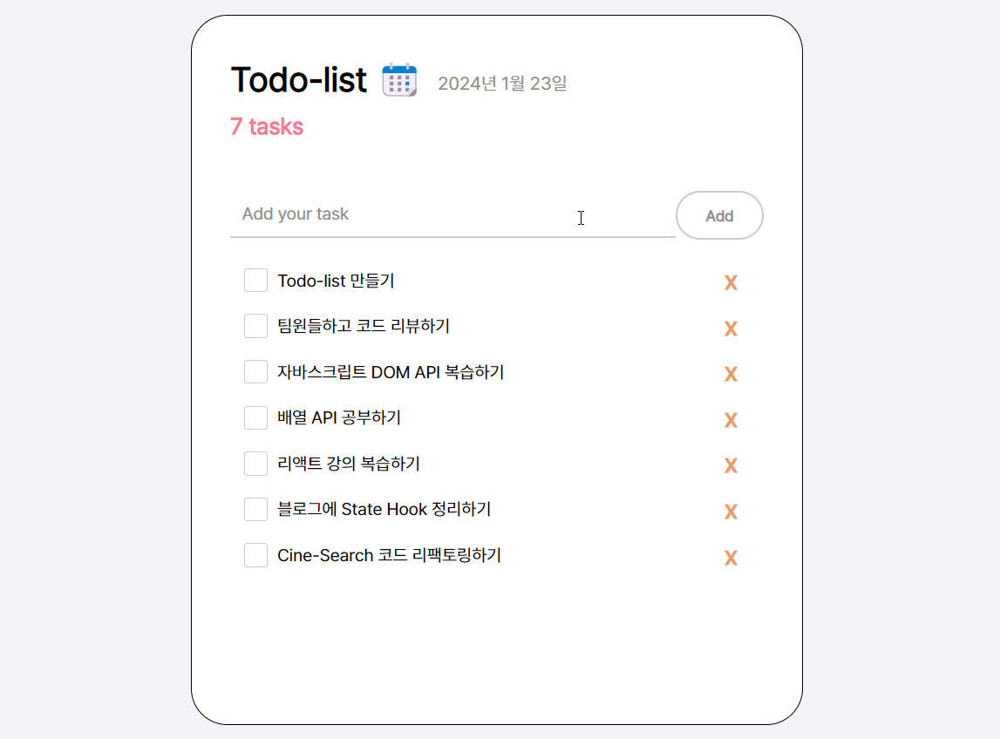

# React로 만든 Todo-list

## 🖥️ 프로젝트 소개

React State Hook을 공부하고 만든 미니프로젝트 입니다.



<br>

## 🗓️ 프로젝트 제작

### 2024.01.21 ~ 2024.01.22(1일)

#### ✅ 주요 기능

1. 할 일 추가: 입력 필드에 할 일을 입력하고 "추가" 버튼을 클릭하여 목록에 새로운 할 일을 추가합니다.

2. 할 일 완료: 할 일 옆의 체크 박스를 클릭하여 해당 할 일을 완료 상태로 토글합니다.

3. 할 일 삭제: 할 일 옆의 "삭제" 버튼을 클릭하여 목록에서 할 일을 제거합니다.

4. 할 일 정렬: 완료된 할 일은 목록의 하단으로 이동하여 정렬됩니다.

#### 🧩 컴포넌트

> App Component

- useState 훅을 사용하여 todos (할 일 목록)와 newTask (새로운 할 일의 입력 값) 상태를 관리합니다.
- 사용자의 입력을 받아 새로운 할 일을 추가하기위해 `handlerAddBtnClick` 함수를 사용합니다.
- 현재 날짜를 표시하기 위해 currentDate를 설정하고 렌더링합니다.

> TodoItems Component

- props로 받은 todos와 setTodos를 사용하여 할일 목록을 표시합니다.
- 각 항목에 대한 완료 여부 토글과 삭제 기능을 제공하기 위해 `handleToggleIsDone`와 `handleDeleteBtnClick` 함수를 TodoList 컴포넌트로 전달합니다.

> TodoInput Component

- 할 일을 입력받고, "Add" 버튼을 클릭하면 새로운 할 일을 목록에 추가합니다.
- `handlervalueChange` 함수는 입력 값의 변화를 감지하여 newTask 상태를 업데이트하며, `handlerAddBtnClick` 함수는 입력 값이 비어 있지 않은 경우에만 새로운 할 일을 생성하여 목록에 추가하고 입력 값을 초기화합니다.

> TodoList Component

- 할 일 목록을 표시하고, 각 할 일에 대한 완료 여부를 토글하거나 삭제할 수 있습니다.
- TodoItems 컴포넌트로부터 전달받은 `handlerToggleIsDone`와 `handleDeleteButtonClick` 함수를 이용하여 각각의 할일 항목에 대한 동작을 처리합니다.
- 할 일 목록은 isDone 상태에 따라 정렬되어 표시됩니다.

<br>

## 🔄 리팩토링

### 1차 : 2024.01.24

#### 리팩토링 내용

- id 생성 방식을 UUID로 변경

  - UUID 라이브러리(uuidv4)를 추가하여 id를 생성하도록 변경하였습니다.
  - 이전의 id 생성 방식은 `id: todos.length + 1`로, 새로운 Todo가 추가될 때마다 배열의 길이에 1을 더한 값을 ID로 사용하였습니다. 그러나 Todo가 삭제되거나 배열의 순서가 변경될 때 중복된 id가 생성되는 문제가 발생했습니다.
  - 이에 따라 UUID를 활용하여 각 Todo에 대한 고유한 id를 생성하도록 변경하였습니다.

### 2차 : 2024.01.25

#### 리팩토링 내용

- Todo 정렬 로직 개선

  - 기존 정렬 로직
    ```js
    const sortedTodos = [...todos].sort((a, b) => {
      if (a.isDone === b.isDone) {
        return 0;
      } else {
        return a.isDone ? 1 : -1;
      }
    });
    ```
  - 수정 정렬 로직

    ```js
    const sortedTodos = [...todos].sort((a, b) => a.isDone - b.isDone);
    ```

- 함수명 변경
  - handleXxxXxx와 같은 컨벤션을 따르도록 함수 이름을 `handlerToggleIsDone`, `handlerAddBtnClick`, `handleDeleteBtnClick`, `handlervalueChange`로 변경하였습니다.
    <br><br>
- 컴포넌트 분리
  - 각각의 Todo 항목을 나타내는 UI를 생성하는 컴포넌트 `TodoList.jsx`를 생성하여 컴포넌트를 분리하였습니다.
  - TodoList Component는 할 일 목록을 표시하고, 각 할 일에 대한 완료 여부를 토글하거나 삭제할 수 있습니다.
    <br><br>
- 컴포넌트 간 결합도 낮추기(Decoupling)
  - App.jsx에 있던 `const [newTask, setNewTask] = useState("");`를 TodoInput 컴포넌트로 옮겨주었습니다.
  - 따라서 TodoInput 컴포넌트로 넘기던 props를 삭제하여, TodoInput 컴포넌트에게 전달되는 props를 최소화하고 필요한 데이터와 권한만을 전달하도록 변경하였습니다.
    <br><br>
- button 엘리먼트로 변경

  - `<div>` 대신에 `<button>` 엘리먼트를 사용하도록 변경하여 시맨틱한 구조를 만들었습니다.

    <br>

## 🎬 시작 가이드

1. git clone repository

```shell
$ git clone https://github.com/MyNameSieun/Todo-List.git
```

2. Install dependencies

```shell
$ npm install
```

3. Start the development server

```shell
$ npm start
```

4. Open the project in your browser

```shell
$ http://localhost:3000
```
